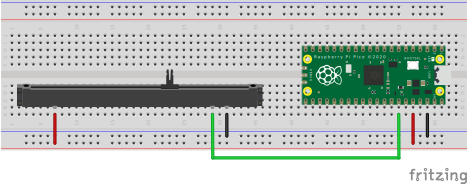

# USB MIDI slider

The code in this folder turns a CircuitPython-compatible microcontrolle board into a USB MIDI slider.

- Download [CircuitPython 7.x](https://circuitpython.org) and flash it to your board (CircuitPython versions higher than 7.x may also work, but compatibility is not guaranteed). Your board will now appear as a USB mass storage device called `CIRCUITPY` volume.
- Download the [Adafruit CircuitPython library bundle](https://github.com/adafruit/Adafruit_CircuitPython_Bundle) compatible with your CircuitPython version, extract it and copy the `adafruit_midi` module into the `lib` folder of the `CIRCUITPY` volume.
- Copy the `.py` files form this folder onto the `CIRCUITPY` volume.
- Customize the `config.py` file according to your board and needs.

The default configuration works with the [Raspberry Pi Pico](https://www.raspberrypi.com/products/raspberry-pi-pico/). See the connection diagram below.

You may need to adjust this with respect to your board and configuration.

Note: Version 7.x of CircuitPython does not support custom naming of USB devices (it seems a planned feature for v8.x: adafruit/circuitpython#6247). To connect the USB MIDI slider with other applications, you may need to look up the device name from your system information. 

## Debugging

The device outputs diagnostic messages to the serial console offered by your board.
